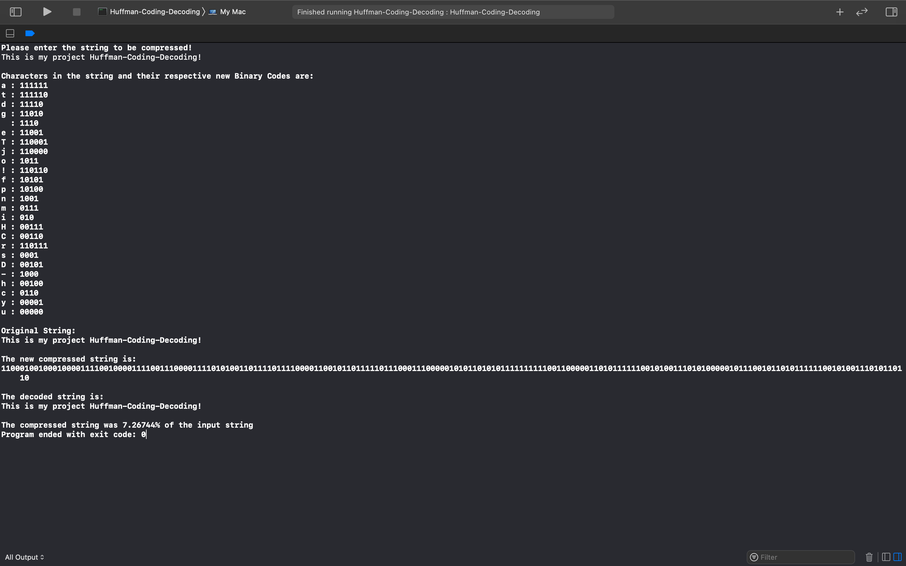

# Huffman-Coding
A C++ data compression algorithm.

## Introduction

This program is for Compression and Decompression of text based on Huffman Coding.
The main idea of Huffman Coding is to reduce the length of the binary codes of frequently-used characters in the text and comparatively longer codes to more used characters

## Implementation Details

This program is capable of compressing and decompressing a text consisting of the 128 ASCII characters.

### Compression

1. Read the input text. Count and store the frequency of each character in that.
2. COnstruct Priority Queue and then the Huffman Tree.
3. Find out the new Huffman Binary Codes of the characters.
4. Encode the text and store the Huffman Table of binary codes along with the text.

### Decompression

1. Open file, recreate the Huffman Tree with the help of the given Huffman Table.
2. Decode the text according to the tree and store the decoded file.

***Huffman Algorithm serializes the encoded text as a binary/decimal sequence and the Huffman binary tree corresponding to that in order to decode back the text in the future.***

Here is a sample output:

# Huffman-Coding-Decoding
